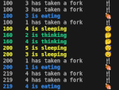

<p align="center">
  
</p>

# Philosophers [Project](doc/PDF/Philosphers_subject.pdf)

## Overview

This project is part of the 42School and simulates the classic problem of the philosophers. The problem describes a situation where several philosophers alternately think and eat, but must share limited resources (forks). The goal is to find a solution that avoids both deadlocks and starvation.

<p align="center">
  
</p>


## Project Objectives

- Understanding and implementing synchronization mechanisms.
- Handling concurrency and parallel programming.
- Ensuring that the program prevents deadlocks and starvation of the philosophers.

## Installation

Clone the repository:
   ```sh
   git clone https://github.com/ELREKO/Philosphers.git
   cd philosopherprojekt
   ```

Compile the project:
   ```sh
   make
   ```

After making changes to the program:
   ```sh
   make re
   ```

## Execution

After compilation, you can run the program with the following command:

```shell
./philo <number_of_philosophers> <time_to_die> <time_to_eat> <time_to_sleep> <optional: number_of_meals_each_philosopher_must_have>
```

Example:
```sh
./philo 5 200 100 70
```
This starts a simulation with 5 philosophers, where each philosopher has 200 milliseconds until they die, needs 100 milliseconds to eat, and must sleep for at least 70 milliseconds.

Example:
```sh
./philo 5 200 100 70 2
```
These are the same parameters as above, with the addition that each philosopher must eat at least 2 times.

## Operation

Each philosopher goes through the following states:

1. **Thinking**: The philosopher thinks for a certain period.
2. **Hungry**: The philosopher tries to grab both forks.
3. **Eating**: The philosopher eats for a certain period.

<p align="center">
  
</p>

### Synchronization

- Forks are implemented as binary semaphores.
- Each philosopher first grabs the left fork and then the right fork (or vice versa, depending on the implementation).
- The synchronization ensures that no two philosophers use the same fork simultaneously.

### Further Information

[Difference between Thread and Process](doc/Proccess_vs_Thread.md)
