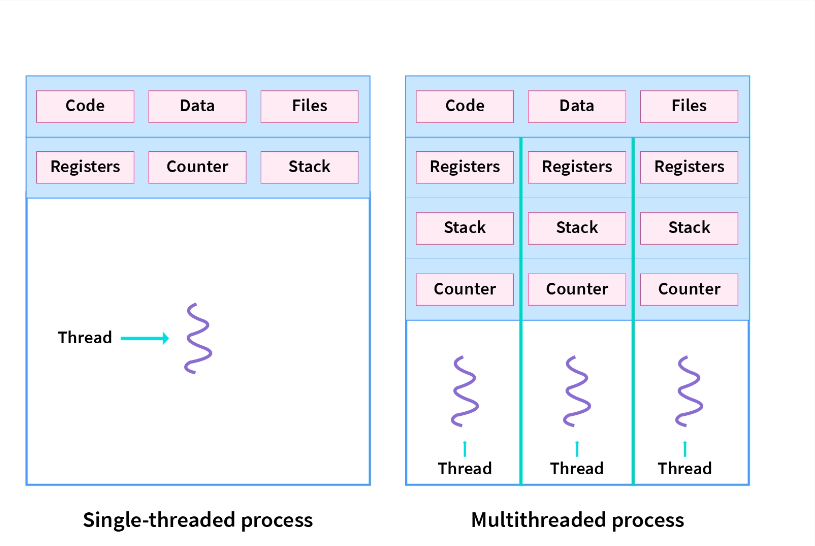

# External Funktion 
## gettimeofday

- `int gettimeofday(struct timeval *tv, struct timezone *tz);
    - `struct timeval` -> enthält secunden udn Millisekunden
### Example time messung 
--> link (gettimeoftoday)

## Unterschied zwischen Thread und Process 
- Ein **Process** ist fuer sich isoliert und abgeschlossen. Eine <u>CPU</u> kann immer <u>nur einen Process</u> bearbeiten. Das bedeutet wenn gibt es nur eine CPU wird Multitasking durch "hin und her" Springen zwischen den Processen gemanaget.

- Ein oder mehrer **Thread** sind ein Bestandteil eines Processes. Da sie im Gegensatz zu den Processen nicht Isoliert sind kann ein Fehlerhafter Thread auswirkungen auf die anderen Threads in einem Process haben. 

##  Links

| Aspekt               | Prozesse                                    | Threads                                   |
|----------------------|---------------------------------------------|-------------------------------------------|
| **Definition**       | Unabhängige Ausführungskontexte             | Ausführungskontexte innerhalb eines Prozesses|
| **Ressourcen**       | Eigene Ressourcen                           | Teilen Ressourcen innerhalb desselben Prozesses|
| **Isolation**        | Vollständig isoliert                        | Weniger isoliert; Thread-Absturz kann den Prozess beeinträchtigen|
| **Kommunikation**    | Über IPC-Mechanismen (z.B., Pipes, Sockets) | Direkte Kommunikation durch gemeinsam genutzte Variablen|
| **Overhead**         | Höherer Overhead (mehr Ressourcen, Zeit)     | Geringerer Overhead, da Teilen von Ressourcen|
| **Stabilität**       | Stabiler (Absturz eines Prozesses beeinträchtigt andere Prozesse nicht)| Anfälliger für Abstürze (Absturz eines Threads kann den gesamten Prozess beeinträchtigen)|
| **Startzeit**        | Längere Startzeit (Erstellung neuer Adressraum)| Kürzere Startzeit (teilen bereits vorhandener Ressourcen)|

---

### Unterschiede zwichen User- und Kernel Thread

| Eigenschaften          | Kernel-Threads                               | User-Level Threads                            |
|------------------------|----------------------------------------------|-----------------------------------------------|
| **Management**         | Vom Betriebssystem-Kernel verwaltet         | Auf Benutzerebene (User-Space) verwaltet      |
| **Systemaufrufe**      | Erfordern oft Systemaufrufe (Kernel-Operationen) | Können ohne Systemaufrufe auskommen, es sei denn, es wird auf Kernel-Ressourcen zugegriffen | 
| **Overhead**           | Höherer Overhead aufgrund der direkten Beteiligung des Kernels | Geringerer Overhead, da auf Benutzerebene verwaltet |
| **Parallelität**       | Kann effizient auf Multi-Core-Systemen skaliert werden | Kann Schwierigkeiten mit Parallelität auf Multi-Core-Systemen haben |
| **Flexibilität**       | Kann besser auf unterschiedliche Systemressourcen und -funktionen zugreifen | Leichtgewichtiger und schneller im Erstellen und Beenden von Threads, aber weniger Kontrolle über Ressourcen |
| **Scheduling**         | Vom Betriebssystem-Kernel nach eigenem Scheduling-Algorithmus verwaltet | Kann vom Scheduler der Laufzeitbibliothek oder Anwendungslogik verwaltet werden |
| **Sichtbarkeit**        | Betriebssystem hat volle Kontrolle und Sichtbarkeit | Betriebssystem hat oft keine direkte Kenntnis von User-Level Threads, behandelt sie als normale Anwendungsprozesse |

