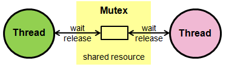

# Mutex 
## Was ist Mutex 
Mutex ist das Handling für die Threads um einen Sicheren Ressourcen Zugriff zu ermöglichen. Das bedeutet das z.B. immer nur ein Thread auf eine Datei Schreiben oder Lesen kann. Die anderen Threads müssen warten bis diese wieder freigebene wird. Somit helfen die Mutex funtionen die Threads besser zu **Syncronisiern** und **Race Conditions** zu vermeiden!

Eine Flasch Verwendung verursacht Deadlocks (2 oder mehr Threads warten auf die Freigabe der Resorchen). Daher ist es auch wichtig dies richtig zu haneln.

## Was ist es nicht! 
Das "Hin- und Herschalten" zwischen Threads, oft als Thread-Scheduling bezeichnet, wird vom Betriebssystem und/oder vom Thread-Scheduler gehandhabt. Dieser Prozess entscheidet, welcher Thread zu welchem Zeitpunkt die CPU-Zeit bekommt.

