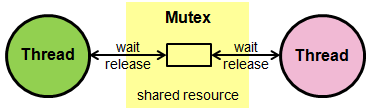

# Mutex
## What is Mutex
Mutex (short for mutual exclusion) is used in threading to ensure safe access to resources. This means that, for example, only one thread can read from or write to a file at any given time. Other threads must wait until the resource is released. Thus, mutex functions help synchronize threads better and prevent race conditions.

Improper use of mutexes can lead to deadlocks (where two or more threads are waiting for resources to be released). Therefore, it is crucial to handle them correctly.

## What it is not!
The process of switching between threads, often referred to as thread scheduling, is managed by the operating system and/or the thread scheduler. This process determines which thread receives CPU time at any given moment.

  

